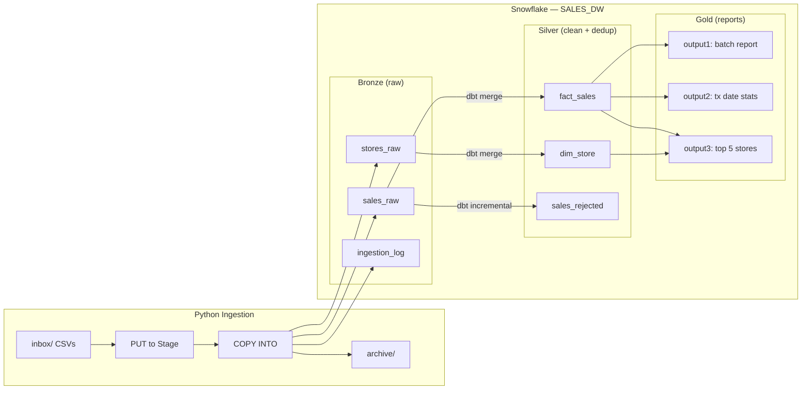

# Store Sales Pipeline

Daily ingestion and reporting pipeline for store sales transactions. Built with **Python**, **Snowflake**, and **dbt Core** using a Bronze/Silver/Gold medallion architecture.

## Architecture



| Layer | Purpose |
|-------|---------|
| **Bronze** | Raw CSV data with ingestion metadata (`batch_date`, `file_name`, `load_ts`) |
| **Silver** | Validated, typed, deduplicated via incremental merge |
| **Gold** | 3 report outputs with retention limits (40/40/10 dates) |

> Designed for millions of daily transactions — all transforms are SQL-based with no Python loops over data. Scales by adjusting Snowflake warehouse size.

## Prerequisites

- Python 3.11+
- Snowflake account ([free trial](https://signup.snowflake.com))
- dbt Core with `dbt-snowflake` adapter (`pip install dbt-snowflake`)
- Git

## Setup

### 1. Clone and install

```bash
git clone <repo-url>
cd store-sales-pipeline
pip install -r requirements.txt
```

### 2. Snowflake setup

Log into your Snowflake account and run the DDL in `snowflake/setup.sql`. This creates the database, schemas (BRONZE/SILVER/GOLD), file format, stage, and Bronze tables.

### 3. Configure

Set your Snowflake credentials as environment variables:

```bash
export SNOWFLAKE_ACCOUNT=your_account.region
export SNOWFLAKE_USER=your_username
export SNOWFLAKE_PASSWORD=your_password
```

Then copy and edit the config file:

```bash
cp config/config.yaml.example config/config.yaml
```

The config file references these environment variables — no credentials are stored in files.

### 4. dbt setup

```bash
pip install dbt-snowflake
cd dbt_project
cp profiles.yml.example profiles.yml
```

The profiles file reads credentials from the same environment variables set in step 3.

## Running the Pipeline

### Step 1: Ingest CSV files

Place your CSV files in the `inbox/` directory, then run:

```bash
python -m ingestion.ingest --config config/config.yaml
```

The script will:
- Discover `stores_*.csv` and `sales_*.csv` files
- Skip files already processed (idempotent via content hash)
- Upload and load data into Snowflake Bronze tables via PUT + COPY INTO
- Move processed files to `archive/`

### Step 2: Run dbt transformations

```bash
cd dbt_project
dbt run --profiles-dir .
dbt test --profiles-dir .
```

This transforms Bronze → Silver → Gold and produces the 3 report outputs.

For a full build (run + test in one command):

```bash
dbt build --profiles-dir .
```

### Step 3: Query outputs

```sql
SELECT * FROM GOLD.GOLD_OUTPUT1_BATCH_REPORT ORDER BY batch_date DESC;
SELECT * FROM GOLD.GOLD_OUTPUT2_TX_DATE_REPORT ORDER BY transaction_date DESC;
SELECT * FROM GOLD.GOLD_OUTPUT3_TOP5_BY_DATE ORDER BY transaction_date DESC, top_rank_id;
```

## Testing with sample data

```bash
mkdir inbox
cp data/sample/*.csv inbox/

python -m ingestion.ingest --config config/config.yaml

cd dbt_project
dbt build --profiles-dir .

cd ..
python -m pytest tests/ -v
```

## Project Structure

```
├── README.md                          This file
├── requirements.txt                   Python dependencies
├── config/
│   └── config.yaml.example            Configuration template
├── docs/
│   ├── design.md                      System design documentation
│   ├── assumptions.md                 Assumptions and decisions log
│   ├── data_model.md                  Logical data model + DDL reference
│   └── questions.md                   Open questions for stakeholders
├── snowflake/
│   └── setup.sql                      Snowflake DDL (schemas, tables, stage)
├── ingestion/
│   ├── ingest.py                      Main ingestion script
│   ├── config.py                      Config loader
│   └── validate.py                    File validation utilities
├── dbt_project/
│   ├── dbt_project.yml                dbt configuration
│   ├── profiles.yml.example           dbt profiles template
│   ├── macros/
│   │   ├── clean_amount.sql           Strip $ and parse amounts
│   │   └── generate_schema_name.sql   Override default schema naming
│   └── models/
│       ├── sources/                   Bronze source definitions
│       ├── silver/                    Clean + dedup models
│       └── gold/                      Report output models
├── data/
│   ├── sample/                        Sample CSV files for testing
│   ├── light/                         Light dataset (50 rows, 3 days)
│   └── generate_samples.py            Generate light + heavy (100k) test data
└── tests/                             Python unit tests
```

## Documentation

- [System Design](docs/design.md) — Architecture, processing flow, design considerations
- [Assumptions](docs/assumptions.md) — Documented assumptions and decisions
- [Data Model](docs/data_model.md) — Logical model, DDL reference, dedup strategy
- [Questions Log](docs/questions.md) — Questions and answers from stakeholders
