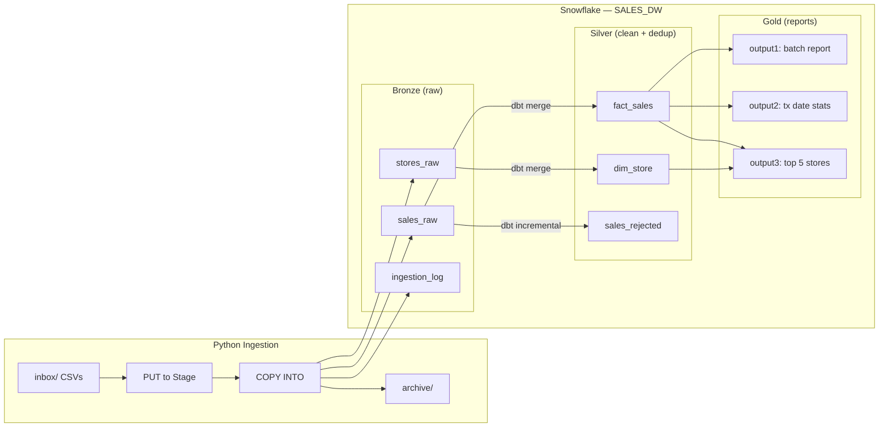
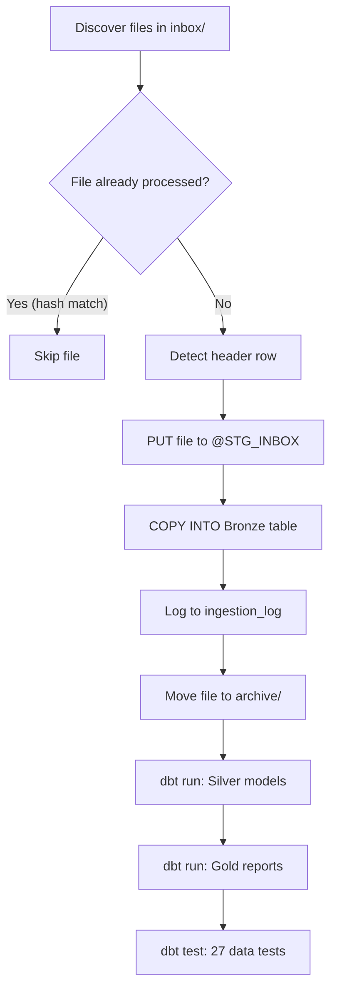

# System Design — Store Sales Pipeline

## Architecture Overview

The pipeline follows a **Bronze / Silver / Gold** medallion architecture on Snowflake, with Python handling ingestion and dbt Core handling all transformations.

### Pipeline Flow

## Processing Flow

### Stage 1: Discover

The Python ingestion script scans the configured `inbox/` directory for files matching `stores_<YYYYMMDD>.csv` or `sales_<YYYYMMDD>.csv`. The batch date is extracted from the filename. Files not matching either pattern are ignored.

### Stage 2: Idempotency Check

Before processing, a SHA-256 content hash is computed for each file. The hash is checked against `BRONZE.INGESTION_LOG`. If already present, the file is skipped. This prevents duplicate processing when files are re-delivered or the pipeline is re-run.

### Stage 3: Header Detection

CSV files may or may not contain a header row. The ingestion script reads the first line and checks if it contains known column names (e.g., `store_group`, `transaction_id`). If headers are detected, `SKIP_HEADER=1` is set for the COPY INTO command.

### Stage 4: Load to Bronze

Files are uploaded to a Snowflake internal stage (`@BRONZE.STG_INBOX`) via PUT, then loaded into Bronze tables via COPY INTO. Metadata columns (`batch_date`, `file_name`, `load_ts`) are added during load. `ON_ERROR = 'CONTINUE'` ensures partial files still load valid rows.

**Design consideration:** Sales files contain 6 data columns as defined in the spec (store_token, transaction_id, receipt_token, transaction_time, amount, user_role). `ERROR_ON_COLUMN_COUNT_MISMATCH = FALSE` in the file format provides resilience against unexpected extra fields.

### Stage 5: Silver Transform (dbt)

dbt incremental models transform Bronze to Silver:

- **silver_dim_store**: SCD Type 2 — tracks attribute changes over time. When `store_name` or `store_group` changes, the old record is closed (`is_current=false`, `valid_to` set) and a new current record is inserted. Downstream joins filter on `is_current=true` for the latest values.
- **silver_fact_sales**: Validates data types (timestamp parsed with explicit format `YYYYMMDDTHH24MISS.FF3` plus standard formats, amount stripped of `$`), filters invalid rows, deduplicates by `(store_token, transaction_id)` keeping the row with the latest `load_ts`
- **silver_sales_rejected**: Captures invalid rows with a `reject_reason` column for audit

**Incremental strategy:** All Silver models use `merge` strategy. On subsequent runs, only rows with `load_ts` greater than the current max are processed, making the pipeline efficient at scale.

### Stage 6: Gold Reports (dbt)

Three report tables are materialized as full tables (rebuilt each run):

- **Output 1** (`gold_output1_batch_report`): Raw/valid/invalid counts per batch date, limited to last 40 batch dates
- **Output 2** (`gold_output2_tx_date_report`): Daily sales stats with month-to-date accumulation and top store, limited to last 40 transaction dates
- **Output 3** (`gold_output3_top5_by_date`): Top 5 stores ranked by daily sales, last 10 transaction dates

### Stage 7: Archive

After successful ingestion, source CSV files are moved to `archive/{type}/{batch_date}/` for historical reference.

## Scalability — Designed for Millions of Daily Transactions

Although the sample data is small, this pipeline is designed to handle production volumes of millions of daily transactions without architectural changes.

| Concern | How it scales |
|---------|---------------|
| **Ingestion throughput** | Snowflake COPY INTO parallelizes automatically by file. Split large files into partitioned CSVs for maximum throughput. |
| **Transform efficiency** | Silver models use incremental merge — only rows with new `load_ts` are processed. Cost stays constant regardless of history size. |
| **Dedup performance** | `QUALIFY ROW_NUMBER()` runs in a single pass over Snowflake's columnar engine. No self-join or temp tables. |
| **Warehouse sizing** | Scale from X-Small to 4XL without code changes. Double the warehouse size = roughly half the runtime. |
| **Query performance** | At production scale, apply `CLUSTER BY (store_token, transaction_time::date)` on `silver_fact_sales` to optimize scan pruning. |
| **Near-real-time** | Replace PUT + COPY with Snowpipe for continuous ingestion. Same Bronze tables, no downstream changes. |
| **New data sources** | Follow the same pattern: new Bronze raw table + Silver dbt model. Gold reports can reference new sources seamlessly. |
| **Orchestration** | Wrap Python ingestion + dbt in Airflow, Snowflake Tasks, or any scheduler. The pipeline is stateless and idempotent. |
