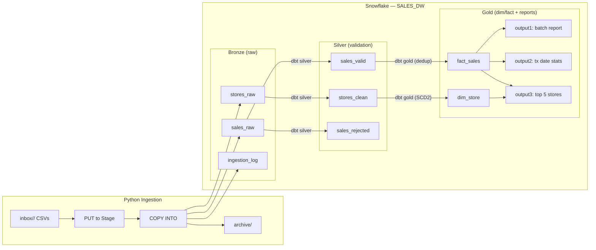

# System Design — Store Sales Pipeline

## Architecture Overview

The pipeline follows a **Bronze / Silver / Gold** medallion architecture on Snowflake, with Python handling ingestion and dbt Core handling all transformations.



### Pipeline Flow

```mermaid
flowchart TD
  start([Start]) --> discover["Discover files in inbox/<ingestion_date>"]

  %% File loop
  discover --> anyFiles{Any CSV files?}
  anyFiles -->|No| loadedThisRun{Any files loaded in this run?}
  anyFiles -->|Yes| nextFile["Pick next CSV file"]

  nextFile --> already{Already processed?}
  already -->|Yes| skipped["Mark as skipped (no COPY)"]
  already -->|No| header["Detect header row"]

  header --> putStage["PUT to @BRONZE.STG_INBOX"]
  putStage --> copyBronze["COPY INTO BRONZE"]
  copyBronze --> logRow["Insert into BRONZE.INGESTION_LOG"]

  %% Archive and loop back
  logRow --> archive["Move file to archive/"]
  skipped --> archive
  archive --> anyFiles

  %% After all files processed, decide whether to run dbt
  loadedThisRun -->|No| end([End])
  loadedThisRun -->|Yes| runSilver["dbt run: Silver (validation)"]
  runSilver --> runGold["dbt run: Gold (dim/fact + reports)"]
  runGold --> end([End])
```

## How This Design Meets the Assessment Requirements

- **Daily files & data sharing method**
  - As the PDF states, every day the partner uploads **zero or more** files into a bucket: one type with **stores’ data** and another with **daily transactions**. For development we treat this bucket as a local `inbox/<ingestion_date>/` folder (for example, `inbox/2026-03-11/...`).
  - Python ingestion scans the chosen `inbox/<ingestion_date>/` folder, detects file type by name (`stores_<batch_date>.csv` vs `sales_<batch_date>.csv`), extracts `batch_date` from the filename, and loads everything into **Bronze** (`BRONZE.STORES_RAW`, `BRONZE.SALES_RAW`) — see `ingestion/ingest.py`.
  - After processing the daily files, they are moved to `archive/{ingestion_date}/{type}/{batch_date}/...`, which is the “different location where we store the historical information” mentioned in the spec.

- **File structure, validation, and “latest received” semantics**
  - Stores: enforce `store_group` (8‑char hex, uppercase), `store_token` (UUID, lowercase), `store_name` (< 200 chars).
  - Sales: enforce the 6 spec columns (`store_token`, `transaction_id`, `receipt_token`, `transaction_time`, `amount`, `user_role`), with flexible
    timestamp parsing (`transaction_time` independent from `batch_date`) and amount normalization from `$NN.NN` to `DECIMAL(11,2)`.
  - Validation happens in **Silver**: `stores_clean`, `sales_valid`, and `sales_rejected` split good and bad rows.
  - Duplicates are handled in **Gold**: `fact_sales` deduplicates on `(store_token, transaction_id)` using `ROW_NUMBER() OVER (PARTITION BY ... ORDER BY load_ts DESC) = 1`, so we always **keep the latest received value**, as the spec requires.

- **Outputs 1, 2, and 3 (with limits)**
  - **Output 1 – by batch_date**: `report_output1_batch_report` computes raw / valid / invalid counts per `batch_date` from Bronze + rejected tables,
    plus processing_date (`MAX(load_ts)::DATE`), and keeps only the **latest 40 batch dates** using `DENSE_RANK()`.
  - **Output 2 – by transaction_date**: `report_output2_tx_date_report` aggregates by `transaction_time::DATE`, computes count of stores, total and
    average amount, and a **month‑to‑date running total** over the full month (not just the 40‑day window), and adds a **bonus** `TOP_STORE_TOKEN` for one
    of the top‑revenue stores. Limited to the **last 40 transaction dates**.
  - **Output 3 – top 5 per date**: `report_output3_top5_by_date` ranks stores by daily sales using `ROW_NUMBER()`, keeps ranks 1–5 per date, joins
    `silver_dim_store` for `store_name`, and limits to the **last 10 transaction dates**, ensuring each date appears at most 5 times.

- **Questions log, assumptions, and data model (Tasks a/b)**
  - **Questions & answers** are logged in [`docs/questions.md`](questions.md) (e.g., 6 vs 7 sales columns, month‑accumulated semantics, documentation format).
  - **Assumptions** that unblock implementation are documented in [`docs/assumptions.md`](assumptions.md) (dedup semantics, formats, retention, multiple files per day,
    etc.).
  - The **logical data model** and relationships (Bronze → Silver → Gold, SCD2 `dim_store`, dedup strategy) are documented in [`docs/data_model.md`](data_model.md),
    and full Snowflake DDL lives in [`snowflake/setup.sql`](../snowflake/setup.sql).

- **Configuration and execution (Tasks c/d, technology constraints)**
  - System configuration is centralized in [`config/config.yaml.example`](../config/config.yaml.example) and [`dbt_project/profiles.yml.example`](../dbt_project/profiles.yml.example),
    with Snowflake credentials read from environment variables, and configurable paths (`inbox`, `archive`) and retention limits (40/40/10).
  - Execution instructions (install, configure, ingest, run dbt, and query outputs) are documented in [`README.md`](../README.md) and the interview
    [`docs/demo_guide.md`](demo_guide.md).
  - The implementation uses **Python** for ingestion and **Snowflake + dbt Core** for storage/processing, and the repo is structured and documented
    for easy sharing with the reviewer on GitHub.

### Technology Choices (Python + Snowflake/dbt)

- **Why Python**: The assessment explicitly calls out “use a programming language, preferably Python”. Python is used only where it adds the most value: file system access, config handling, and orchestrating `PUT` + `COPY INTO`. All data‑intensive work (validation, dedup, aggregations) is pushed down to Snowflake as SQL, so there are **no Python loops over data rows**, just loops over files.
- **Why Snowflake + dbt instead of Postgres**: Any database would satisfy “use of a database (e.g. Postgres or other)”, but Snowflake aligns better with the “millions of daily transactions” requirement: elastic warehouses, fast `COPY INTO`, and window functions at scale. dbt Core adds versioned, testable SQL models (Bronze → Silver → Gold) and incremental `merge` semantics, making the pipeline easy to extend (new sources, new outputs) without changing the ingestion code.

### Why SCD Type 2 for Stores

- The spec says store files are **additive**, but in practice store attributes (especially `store_name` and `store_group`) can change over time.
- Using **SCD Type 2** on `silver_dim_store` lets us keep a full history of those changes (with `valid_from`/`valid_to` and `is_current`) while still joining to the latest values in reports (`is_current = true`).
- This gives the best of both worlds for the assessment: a simple current‑state view for Outputs 2/3, plus the ability to answer historical questions later (e.g. “what was the name/group of this store when the transaction happened?”) without redesigning the model.

## Processing Flow

### Stage 1: Discover

The Python ingestion script scans the configured `inbox/<ingestion_date>/` directory for files matching `stores_<YYYYMMDD>.csv` or `sales_<YYYYMMDD>.csv`. The batch date is extracted from the filename. Files not matching either pattern are ignored.

### Stage 2: Idempotency Check

Before processing, the ingestion script checks `BRONZE.INGESTION_LOG` for a row with the same `(file_type, batch_date, file_name)` and `status = 'LOADED'`. If present, the file is skipped as **already processed**. This keeps the pipeline safe to re-run and handles the pattern where upstream may resend the last few days of files each day.

### Stage 3: Header Detection

CSV files may or may not contain a header row. The ingestion script reads the first line and checks if it contains known column names (e.g., `store_group`, `transaction_id`). If headers are detected, `SKIP_HEADER=1` is set for the COPY INTO command.

### Stage 4: Load to Bronze

Files are uploaded to a Snowflake internal stage (`@BRONZE.STG_INBOX`) via PUT, then loaded into Bronze tables via COPY INTO. Metadata columns (`batch_date`, `file_name`, `load_ts`) are added during load. `ON_ERROR = 'CONTINUE'` ensures partial files still load valid rows.

**Design consideration:** Sales files contain 6 data columns as defined in the spec (store_token, transaction_id, receipt_token, transaction_time, amount, user_role). `ERROR_ON_COLUMN_COUNT_MISMATCH = FALSE` in the file format provides resilience against unexpected extra fields.

### Stage 5: Silver Transform (dbt)

dbt incremental models transform Bronze to Silver **for validation only**:

- **stores_clean**: Validates basic store formats (8‑char hex group, UUID token, name length) and keeps only valid rows.
- **sales_valid**: Parses timestamps/amounts and keeps only structurally valid sales rows.
- **sales_rejected**: Captures invalid rows with a `reject_reason` column for audit.

Silver is the **quality gate**: everything that passes goes to `sales_valid` / `stores_clean`, everything that fails goes to `sales_rejected`.

### Stage 6: Gold Dim/Fact + Reports (dbt)

Gold builds the **analytics model** (dim/fact). A separate **REPORTS** schema contains the three report tables built on top of Gold:

- **dim_store** (SCD Type 2) built from `stores_clean`: tracks attribute changes over time (`valid_from`/`valid_to`, `is_current`).
- **fact_sales** built from `sales_valid`: deduplicates by `(store_token, transaction_id)` keeping the row with the latest `load_ts`.
- **Output 1** (`report_output1_batch_report` in schema REPORTS): Raw/valid/invalid counts per batch date, limited to last 40 batch dates.
- **Output 2** (`report_output2_tx_date_report` in schema REPORTS): Daily sales stats with month-to-date accumulation and top store, limited to last 40 transaction dates.
- **Output 3** (`report_output3_top5_by_date` in schema REPORTS): Top 5 stores ranked by daily sales, last 10 transaction dates.

### Stage 7: Archive

After successful ingestion, source CSV files are moved to `archive/{type}/{batch_date}/` for historical reference.

## Multiple Files per Batch Date

The spec states "one or more files" per day, so the system is designed to handle multiple sales files sharing the same `batch_date`:

- **Ingestion**: all CSVs under the chosen `inbox/<ingestion_date>/` folder are processed independently.
- **Idempotency**: based on `(file_type, batch_date, file_name)`. If we have already logged the same triple as `LOADED`, the file is skipped. This also safely handles patterns like "always resend the last 3 days of files".
- **Bronze**: All new files land in `SALES_RAW` with the same `batch_date` but different `file_name` / `load_ts`.
- **Gold dedup**: `QUALIFY ROW_NUMBER() OVER (PARTITION BY store_token, transaction_id ORDER BY load_ts DESC) = 1` in `fact_sales` keeps the latest received across all files.
- **Archive**: Processed files are moved to `archive/{ingestion_date}/{type}/{batch_date}/...`, keeping a simple history of what arrived each day.
- **Batch date extraction**: The regex extracts the first `YYYYMMDD` pattern found in the filename, so formats like `sales_20211001_2.csv` are also supported.

## Key Considerations from Spec

1. **`transaction_time` ≠ `batch_date`**: These are independent concepts. `batch_date` (from the filename) tracks when the file was delivered; `transaction_time` (from the row data) is when the sale actually occurred. Silver and Gold use `transaction_time` for analytics, while `batch_date` drives Output 1 (ingestion tracking).

2. **Dedup key = `(store_token, transaction_id)`**: As stated in the spec, a unique transaction is identified by this combination. In the Gold fact table (`fact_sales`) we apply `QUALIFY ROW_NUMBER() OVER (PARTITION BY store_token, transaction_id ORDER BY load_ts DESC) = 1` to enforce this.

3. **Duplicated transactions, latest received wins**: The spec states that duplicated transactions may happen and that a unique transaction is the combination of `store_token` and `transaction_id`, keeping the **latest received value**. In `fact_sales` we implement this by partitioning on `(store_token, transaction_id)` and ordering by `load_ts DESC`, so only the row with the most recent ingestion timestamp is kept in the fact table; earlier duplicates are overwritten by the incremental merge.

## Scalability — Designed for Millions of Daily Transactions

Although the sample data is small, this pipeline is designed to handle production volumes of millions of daily transactions without architectural changes.

| Concern | How it scales |
|---------|---------------|
| **Ingestion throughput** | Snowflake COPY INTO parallelizes automatically by file. Split large files into partitioned CSVs for maximum throughput. |
| **Transform efficiency** | Silver and Gold models use incremental merge — only rows with new `load_ts` are processed. Cost stays constant regardless of history size. |
| **Dedup performance** | `QUALIFY ROW_NUMBER()` runs in a single pass over Snowflake's columnar engine. No self-join or temp tables. |
| **Warehouse sizing** | Scale from X-Small to 4XL without code changes. Double the warehouse size = roughly half the runtime. |
| **Query performance** | At production scale, apply `CLUSTER BY (store_token, transaction_time::date)` on `fact_sales` to optimize scan pruning. |
| **Near-real-time** | Replace PUT + COPY with Snowpipe for continuous ingestion. Same Bronze tables, no downstream changes. |
| **New data sources** | Follow the same pattern: new Bronze raw table + Silver dbt model. Gold reports can reference new sources seamlessly. |
| **Orchestration** | Wrap Python ingestion + dbt in Airflow, Snowflake Tasks, or any scheduler. The pipeline is stateless and idempotent. |

In practice, the project was also tested with a **multi‑day synthetic dataset** that includes:

- Many batch dates and multiple files for the same day (e.g. `sales_YYYYMMDD.csv` + `sales_YYYYMMDD_2.csv`) to exercise the 40/40/10 retention windows and dedup across files.
- Random duplicates and invalid rows to validate that Silver and `sales_rejected` scale with more volume without changing any code.

The key scalability decisions are:

- **All heavy lifting in SQL** (window functions, aggregates, joins) rather than Python loops, so performance scales with Snowflake’s warehouse size, not the Python process.
- **Incremental models** in Silver and Gold avoid reprocessing history; only new `load_ts` slices are transformed on each run.
- **Idempotent file processing** via a simple `(file_type, batch_date, file_name)` rule keeps ingestion easy to understand and safe to retry, even if upstream re‑delivers the last few days of files.

